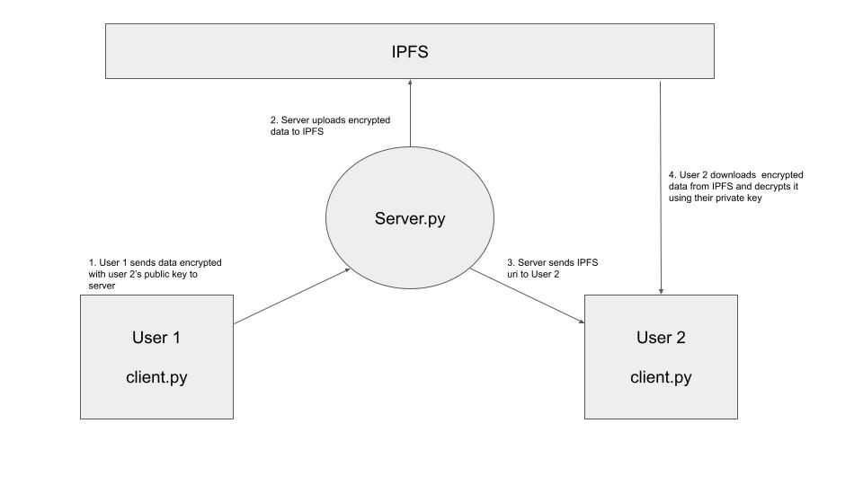
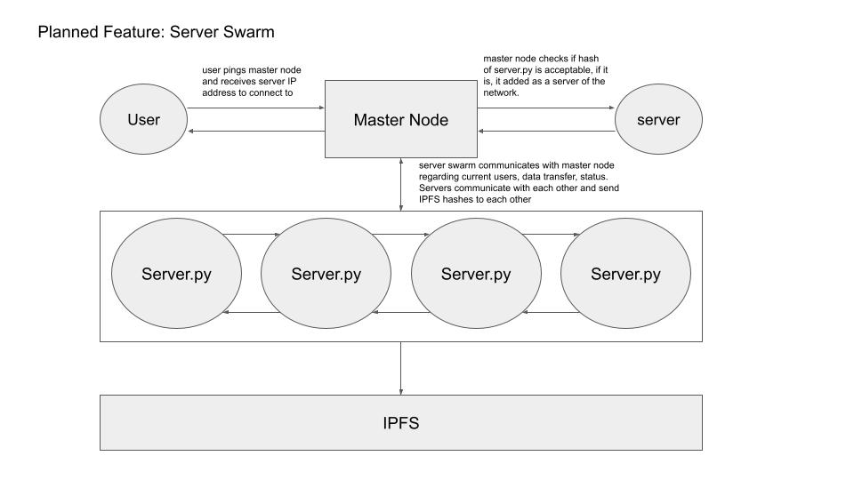

## Flux Chat - IPFS messenger 

#### Minimum viable product: 
Chat application where users send encrypted messages and data over IPFS

#### Current working features:

Users connect to server.py using client.py

client username is their public key

#### Basic Schema (Currently working):

#### Planned Feature Schema: 

#### Functions

1) Decentralized cryptographic chat application
2) Users can access messages anywhere 
3) Server.py uploads map of hashes connecting users to ipfs hashes (user inbox function)

#### how to test:

1) run server.py
2) run two instances of client/client.py
